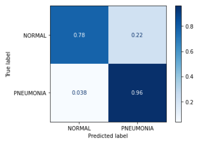

# X-Ray_Image_Project


## Business Problem
Pneumonia is a respiratory infection caused by bacteria or viruses especially in developing countries and underdeveloped nations, where high levels of pollution and unhygienic living conditions. Early detection of pneumonia is crucial to ensure curative treatment and also increase survival rates. Chest X-Ray imaging is the most frequently used method for diagnosing pneumonia. However, the examination of Chest X-rays is a challenging task and is prone to subjective variability. The normal process involves grading the X-rays until it reaches the final score before confirming that a patient actually has pneumonia and that usually takes time and sometimes causes error.

## Data Overview
We obtained our data from Kaggle: https://www.kaggle.com/paultimothymooney/chest-xray-pneumonia which was originally sourced from the journal paper **Identifying Medical Diagnoses and Treatable Diseases by Image-Based Deep Learning** by Kermany et al.:https://www.cell.com/cell/fulltext/S0092-8674(18)30154-5
- The data is organized into three different folders (train,val,test) and each contains subfolders for each category. 
- There are 5863 X-Ray images(JPEG) and 2 categories which are (PNEUMONIA/NORMAL).


## Project Result


- The VGG19 Pretrained Model predicts an accuracy score of 89% on unseen data(test set). This means our model is more generalizable and can be applied to real world pneumonia detection.
- Confusion Matrix shows that our model successfully detect the 96% of the pneumonia patient to be positive. This means our model has a high recall and our model successfully reduces the chance of patients to not get instant treatment. This will lead to reducing mortality rate.

## Conclusions
- We recommend the Doctors and Radiology Society to employ our predictive model to identify which patients have Pneumonia and the risk. Our model will also help the Radiology Society reduce grading errors when looking at the X-Ray images, using our model to predict can help them identify the high risk patients with which they can quickly start medication.
- To use the model effectively, Doctors and Radiology Society need to gather enough Chest X-ray images, look at the dimension,and use it to predict the categories that will maximize the potential of the model for accuracy while minimizing the loss.
-Our model successfully increased accuracy while showing high recall. However, we have relatively low precision scores which can be further tuned in the next steps.


## Next Steps
- **Further Tuning:** It is an eternal goal for the diagnostic exams to reduce the cases of both false-positive and false-negative. Our model shows high recall but relatively low precision. Therefore, we can further tune the model to reduce precision while maintaining current recall score.
- **Large Dataset:** The dataset size is considered a critical property in determining the performance of a model. As the dataset grows larger, our observation gets more dense, and the more confident we can be about our model's predictions. Therefore, gathering more chest X-ray images will help enhance the performance of the model.
- **Application to Covid-19:** Pneumonia is one of the common symptoms of Covid-19. There are reported pneumonia cases where the viral infection could not be detected on the X-ray image, then suddenly the condition of the patient gets worse, ending up in the fatal conditions. By training our model with the chest X-ray images of the Covid -19 patients, there is a chance to apply this model to detecting pneumonia from Covid-19 patients before the condition becomes fatally unwell and reduce the mortality rate.

## Repository Structure

```
├── Images                              <- Folder containing graphs and images
│   └── ...
├── notebooks                           <- Directory containing individual group members' notebooks
│   ├── Teetee                
│   │   └── ...
│   ├── Tony                  
│   │   └── ...
│   └── Paul                  
│   │   └── ...
│   ├── ChestXRayImageProject.ipynb       <- Narrative documentation of project in Jupyter notebook
├── Presentation                          <- PDF version of project presentation
└── README.md                             <- Top-level README
``` 

## AUthors
- Titilayo Amuwo(Teetee)
- Paul Shin
- Tony Bennett
